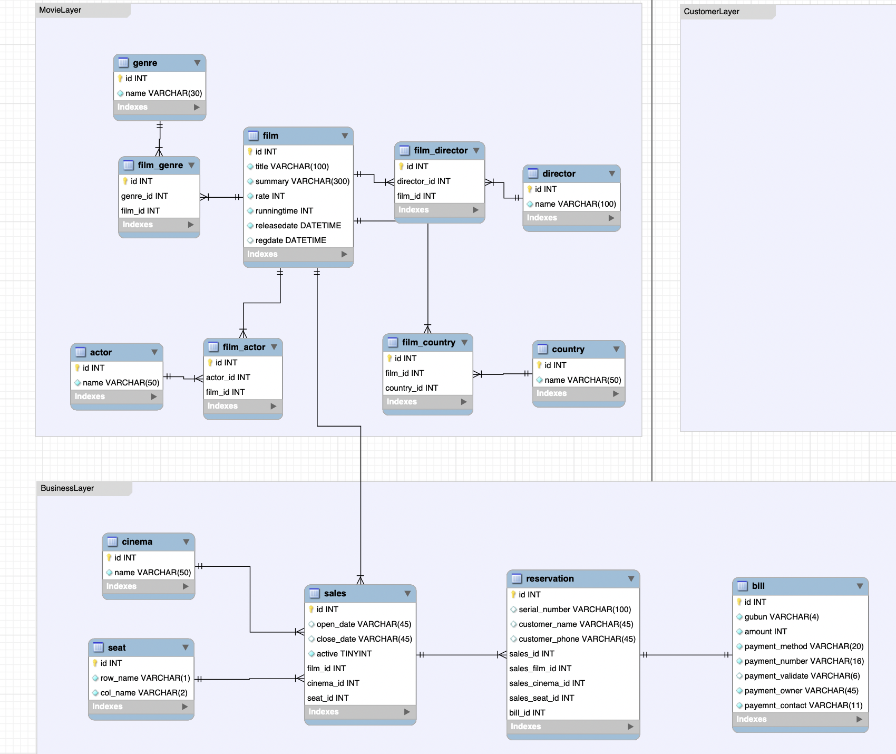

# Proejct Name 
nest.cgv

# Project Schedule
2021.11.16 ~ 2021.12.16

# Project Purpose
1. 타입스크립트의 이해
1. NestJS 이해
2. Git 시스템 이해
3. 포트폴리오 작성

# Naming Convension
코드 작성 : camelCase 방식

파일 작성 : 단어와 단어 사이에 `.` 을 넣어 표기

예시: login.controller, login.dto, login.entity ... 

# modeling

